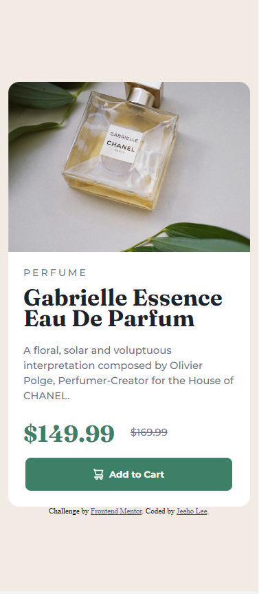
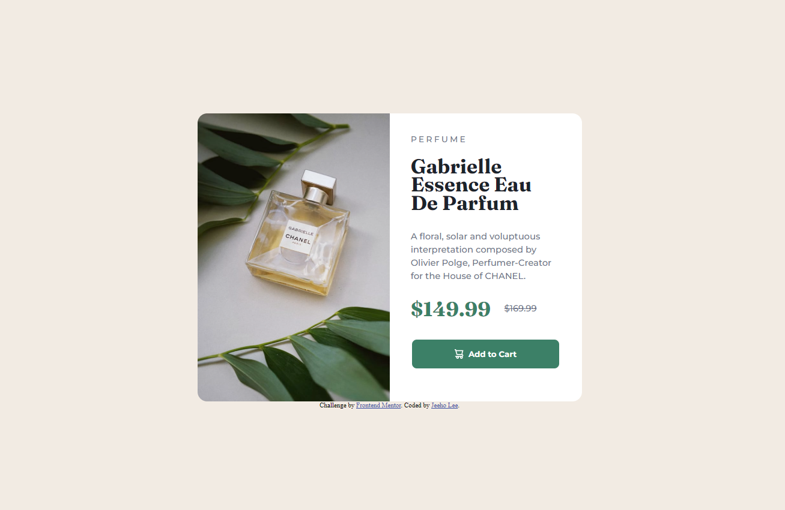
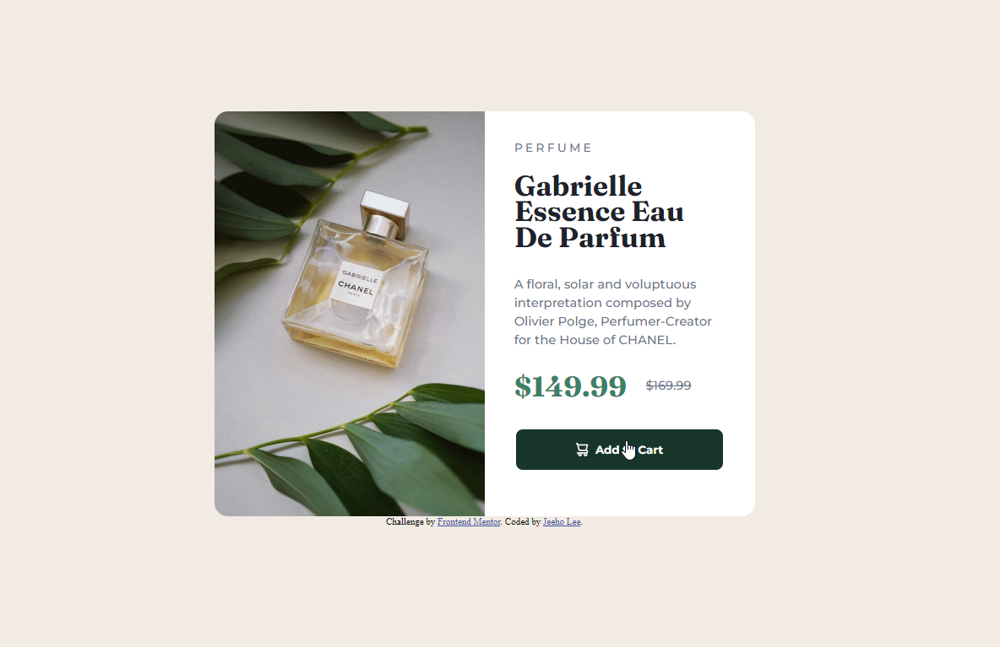

# Frontend Mentor - Product preview card component solution

This is a solution to the [Product preview card component challenge on Frontend Mentor](https://www.frontendmentor.io/challenges/product-preview-card-component-GO7UmttRfa). Frontend Mentor challenges help you improve your coding skills by building realistic projects. 

## Table of contents

- [Overview](#overview)
  - [The challenge](#the-challenge)
  - [Screenshot](#screenshot)
  - [Links](#links)
- [My process](#my-process)
  - [Built with](#built-with)
  - [What I learned](#what-i-learned)
  - [Continued development](#continued-development)
- [Author](#author)

## Overview

### The challenge

Users should be able to:

- View the optimal layout depending on their device's screen size
- See hover and focus states for interactive elements

### Screenshot

### Links

- Solution URL: [https://github.com/jeeheezy/FEM-Product-Preview-Card-Component](https://github.com/jeeheezy/FEM-Product-Preview-Card-Component)
- Live Site URL: [https://jeeheezy.github.io/FEM-Product-Preview-Card-Component/](https://jeeheezy.github.io/FEM-Product-Preview-Card-Component/)

## My process

### Built with

- Semantic HTML5 markup
- CSS custom properties
- Flexbox
- Mobile-first workflow

### What I learned

This was a nice recap in making use of box-sizing with Flexbox. This was also my first time adding colors as CSS custom properties on the root, which was nice to avoid having to reference the hsl values every time they are used.

### Continued development

Keeping mobile development first in mind, and making good use of Flexbox.

## Author

- LinkedIn - [Jeeho Lee](https://www.linkedin.com/in/jeeho-lee-719852182/)
- Frontend Mentor - [@jeeheezy](https://www.frontendmentor.io/profile/jeeheezy)

